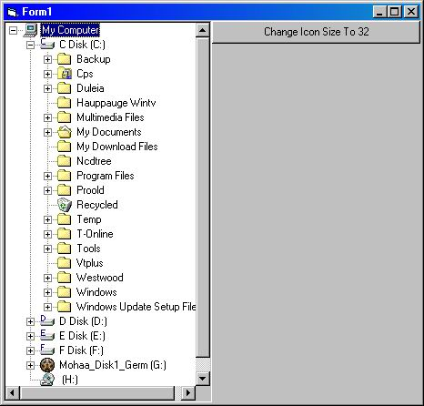



## Folder Tree Like Windows Explorer

### Description

Fast Folder Explorer.Plus Some new Functions.

Olso Change the size of icons to (16 or 32)

if you wand send your commend's.
 
### More Info
 

             |
---                |---
**Submitted On**   |2003-05-02 23:21:04
**By**             |[Toni](https://github.com/Planet-Source-Code/PSCIndex/blob/master/ByAuthor/toni.md)
**Level**          |Advanced
**User Rating**    |5.0 (10 globes from 2 users)
**Compatibility**  |VB 6\.0
**Category**       |[Files/ File Controls/ Input/ Output](https://github.com/Planet-Source-Code/PSCIndex/blob/master/ByCategory/files-file-controls-input-output__1-3.md)
**World**          |[Visual Basic](https://github.com/Planet-Source-Code/PSCIndex/blob/master/ByWorld/visual-basic.md)
**Archive File**   |[Folder\_Tre158246522003\.zip](https://github.com/Planet-Source-Code/toni-folder-tree-like-windows-explorer__1-45201/archive/master.zip)

